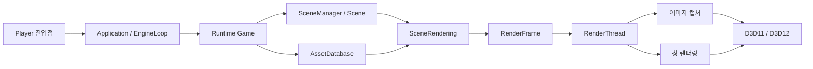

# 아키텍처

GameEngine, GameEditor, GameBuilder는 한 저장소의 별도 CMake 타깃이다. 엔진 정적 라이브러리와 도구를 같은 API·빌드 규칙·테스트로 관리하며, 게임 콘텐츠와 게임별 C++ 컴포넌트는 외부 소스 디렉터리로 연결한다. 공개 소스에는 SampleGame을 포함하지 않는다.

## 프로젝트와 모듈

| 경로 | 책임 |
| --- | --- |
| `GameEngine/` | 공통 엔진 정적 라이브러리 |
| `GameEditor/` | 편집 문서, 패널, Play, 프로젝트 빌드 요청과 Editor 콘텐츠 |
| `GameBuilder/` | CMake 컴파일과 패키징을 연결하는 CLI |
| `GameEngineTests/` | 엔진·도구 회귀와 자체 생성 테스트 입력 |
| `cmake/` | 공통 컴파일·링크·콘텐츠 스테이징 규칙 |

엔진 내부의 주요 경계는 다음과 같다.

| 모듈 | 책임 |
| --- | --- |
| `Core` | `Guid`·`Json`·`TextEncoding`: 범용 식별자·JSON·문자 인코딩 |
| `Math` | 벡터·행렬·plain-float 저장 타입·쿼터니언·색상·2D/3D 축 정렬 경계 상자 |
| `Diagnostics` | 로깅·진단 |
| `Platform` | 창·입력·콘텐츠·오디오 인터페이스, 텍스트 파일 I/O·루트 상대 경로 검사와 Win32 구현 |
| `UIModel` | Runtime과 즉시 모드 UI가 공유하는 선택·텍스트 편집 상태 모델 |
| `Assets`, `Animation`, `Text` | 임포트·리소스 ID·메시 정점 데이터, 골격·클립, 글꼴 해석·래스터화 |
| `Runtime` | Game·Scene·GameObject·Component, 물리·입력·유지형 UI·오디오 |
| `Serialization` | 컴포넌트 속성 표와 씬 데이터의 저장·복원 |
| `Rendering` | API 중립 프레임·sprite/text 정점 계약, 공통 패스·정책과 D3D11/D3D12 백엔드 |
| `SceneRendering` | 런타임 씬을 렌더 프레임으로 변환 |
| `App`, `Player` | 실행 진입점, 애플리케이션 조립과 프레임 루프 |
| `UI`, `Build` | 도구용 즉시 모드 UI·텍스트 폭 맞춤 정책, 프로젝트 패키징 서비스 |

`Runtime`은 주입받은 씬 로더를 사용하며 `Serialization` 구현을 포함하지 않는다. `Rendering`은 런타임 오브젝트를 직접 알지 않고, `SceneRendering`이 두 계층을 연결한다. Win32와 Direct3D 자원은 해당 구현 디렉터리가 소유한다. 플랫폼 인터페이스의 존재가 다른 운영체제나 그래픽 API 구현을 뜻하지는 않는다.

`UIModel`의 [ChoiceModel](../GameEngine/UIModel/ChoiceModel.h)과 [TextEditModel](../GameEngine/UIModel/TextEditModel.h)은 선택·편집 상태 전이를 값으로 처리한다. Core 2층 위의 3층이며 Runtime 9층과 UI 12층이 함께 사용한다. 같은 3층의 Platform과는 서로 의존하지 않는다. 텍스트 측정 콜백을 받아 표시 폭과 말줄임을 결정하는 [TextFit](../GameEngine/UI/TextFit.h)은 UI가 소유한다.

[Math/Float.h](../GameEngine/Math/Float.h)는 `Float2`·`Float3`·`Float4`·행 우선 `Float4x4`를, [Assets/VertexLayout.h](../GameEngine/Assets/VertexLayout.h)는 `MeshVertex`·`SkinnedMeshVertex`를, [Rendering/SpriteVertex.h](../GameEngine/Rendering/SpriteVertex.h)는 sprite/text 정점을 정의한다. `ShaderInterop.h`는 이 타입을 사용해 셰이더 상수와 quad 정점 데이터를 정의하며, 두 백엔드는 같은 필드·크기·오프셋 계약을 사용한다.

[Aabb2D](../GameEngine/Math/Aabb2D.h)와 [Aabb3D](../GameEngine/Math/Aabb3D.h)는 물리·에셋·컬링이 공유하는 수학 값이다. 2D 경계는 넓이가 없으면 비어 있고, 3D 경계는 평면·점을 렌더링 경계로 보존한다. 3D 물리는 `HasVolume()`으로 부피가 있는 경계를 구분한다.

## 실행과 프레임 흐름

[Win32PlayerEntry.cpp](../GameEngine/Player/Win32PlayerEntry.cpp)가 플랫폼 시동을 준비하고 [RunPlayer](../GameEngine/App/PlayerMain.cpp)로 실행을 넘긴다. 게임 프로젝트는 별도의 `main`을 작성하지 않고 콘텐츠와 선택적인 컴포넌트 등록을 제공한다. 공통 CMake 함수가 엔진의 진입점 연결과 런타임 파일 배치를 설정한다.

게임 업데이트와 장면 수집은 게임 스레드에서 끝낸다. 값 기반 `RenderFrame`과 공유된 불변 페이로드를 렌더 스레드로 전달하며, 렌더 스레드는 캡처 요청과 창 그리기를 처리한다. Scene View는 편집 카메라로 가시 영역을 수집하고 화면 공간 게임 UI를 제외한다. Game View는 게임 카메라를 사용한다.

승인된 창 닫기는 메시지 루프에 종료를 알린다. 애플리케이션은 렌더 스레드를 멈추고 그래픽 자원을 해제한 뒤 창을 파괴하므로, 처리 중인 프레임의 출력 표면은 종료가 끝날 때까지 유지된다.

프레임은 이미 해석한 메시·텍스처·텍스트 데이터를 전달한다. 백엔드는 모델이나 이미지 파일을 다시 열지 않고 이 데이터로 GPU 자원을 준비한다. 동적 UI 픽셀의 갱신은 기존 프레임의 스냅샷을 바꾸지 않으며, 마지막 공유 참조가 해제된 CPU 저장 공간만 재사용한다. D3D12 업로드 자원도 해당 GPU 제출이 완료되기 전에는 재사용·해제하지 않는다.

## 씬·컴포넌트·콘텐츠

컴포넌트의 타입과 속성 표를 씬 직렬화, Inspector와 컴포넌트 목록이 공유한다. 프로젝트 타입은 자신의 번역 단위에서 정적으로 등록한다. Editor에서 실제 프로젝트 코드를 실행하려면 그 오브젝트 라이브러리를 링크하고 Editor를 다시 빌드해야 한다.

`.gameproject`가 있는 디렉터리가 콘텐츠 루트다. `sourceRootPath`는 그 설명자 기준으로 Editor의 Build와 스크립트 생성에 사용할 코드 루트를 가리킨다. 콘텐츠 아래의 설명자와 상위 소스 디렉터리를 나누면 `..`를 지정한다. GameBuilder는 이 값을 해석하는 대신 `--project`로 CMake 소스 디렉터리를 직접 받는다.

에셋은 GUID와 파일 내 local ID로 참조하고, `.meta`에 정체성과 임포트 설정을 둔다. `AssetDatabase`가 임포트한 페이로드를 프레임과 공유하며, 씬 언로드 시 참조되지 않는 데이터를 정리한다. 진행 중인 프레임의 참조는 그 수명 동안 유지한다.

배포 파일은 `IContentSource`를 통해 읽는다. 디렉터리 배포와 실행 파일에 덧붙인 콘텐츠 팩이 같은 인터페이스를 사용하므로, 게임 코드가 콘텐츠 상대 경로를 임의의 디스크 경로로 열어서는 안 된다.

씬 전체 종료는 조회 구조와 모든 오브젝트의 씬 연결을 해제한 뒤 종료 콜백을 실행한다. 일반 씬 언로드에서는 콜백이 다른 씬을 변경할 수 있다. 한 씬만 남기는 `RetainOnlyScene` 작업과 SceneManager 자체 종료는 콜백의 장면 집합 변경을 막아 종료 범위를 유지한다.

## Editor와 Builder

Editor는 엔진의 게임 프로젝트·부트스트랩 확장 경로를 사용한다. 엔진 라이브러리가 Editor의 패널이나 문서 구현에 의존하지 않는다. Play는 열린 편집 씬 하나만 활성인 상태에서 시작하고 편집 스냅샷을 보관한다. Stop은 그 씬을 복원하고 실행 중 추가된 씬을 정리하며, 복원 실패 시 재시도할 스냅샷과 Play 상태를 유지한다.

편집 이력의 [UndoStack과 IEditCommand](../GameEditor/Source/Document/UndoStack.h)는 Editor의 Document 계층이 소유한다. 편집 Undo는 부모·형제 위치·로컬 변환을 복원한다. 화면 UI의 계층·창·modal 순서는 그리기와 입력 판정이 함께 사용한다. 세부 사용법은 [GameEditor](../GameEditor/README.md)에 있다.

Editor의 드래그 시작 문턱·드롭·취소 상태는 [Rules/DragGesture](../GameEditor/Source/Rules/DragGesture.h)가 담당하며 Views와 Shell이 사용한다.

GameBuilder CLI는 이미 구성된 CMake 트리에서 게임을 컴파일한 뒤 엔진의 `Build::ProjectBuilder`에 패키징을 요청한다. 빌드 전후로 타깃의 소스 출처를 확인하고 자동 재구성 후 출력 경로를 다시 읽는다. 패키지는 독립 임시 디렉터리에서 조립·검증한 다음 게시하며, 게시 실패 시 기존 출력을 복원한다.

외부 게임 선언과 출력 계약은 [공통 CMake](../cmake/GameEngineProject.cmake), CLI 사용법은 [GameBuilder](../GameBuilder/README.md), 패키지 수명과 검증 경계는 [빌드 시스템](../GameEngine/Build/BUILD_SYSTEM.md)을 참고한다.

## 검증

[검증 안내](VALIDATION.md)는 공개 기본 구성, 선택적 외부 입력, 검증 절차와 실제 확인 상태를 구분한다. 테스트 통과는 특정 환경·입력의 결과이며 지원 범위 전체에 대한 성능 보장이 아니다.
